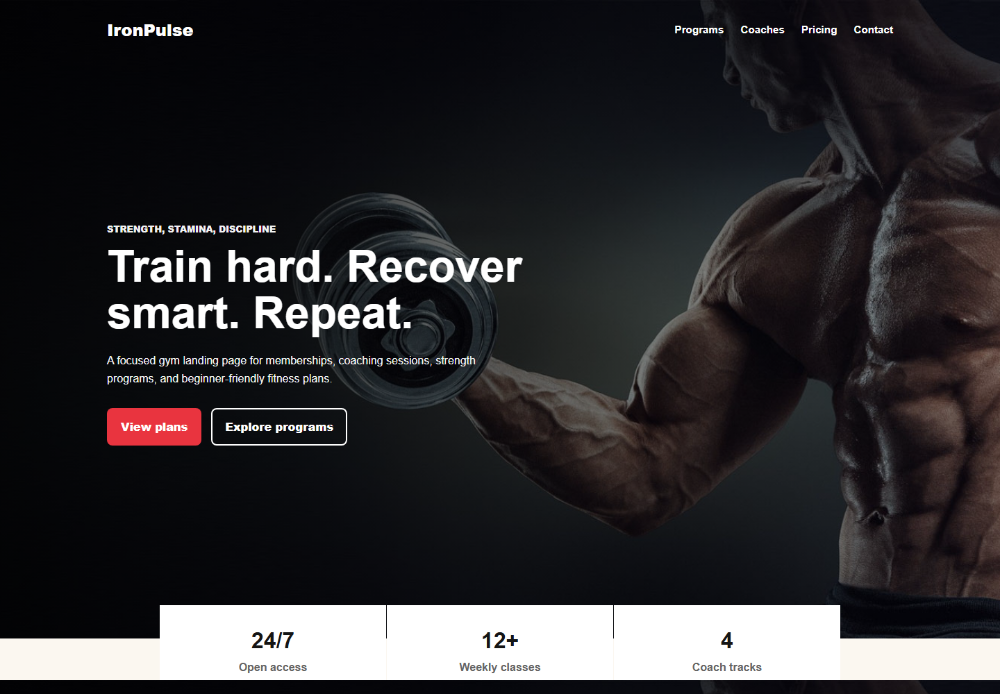

# IronPulse Gym Website



A responsive gym landing page built with HTML, CSS, and JavaScript. The page uses the images already in this repository and turns the old single hero into a complete small business website.

## Live Demo

https://rajesh-d-kasar.github.io/gym-web/

## Sections

- Hero section with calls to action.
- Training program cards.
- Coach support details.
- Membership pricing.
- Contact form with a JavaScript confirmation.

## Run Locally

Open `index.html` in a browser.

## Deploy

This project is deployed with GitHub Pages from the `main` branch root.

## Files

```text
gym-web/
|-- index.html
|-- style.css
|-- script.js
|-- assets/
|   `-- screenshot.png
|-- README.md
`-- image assets
```
